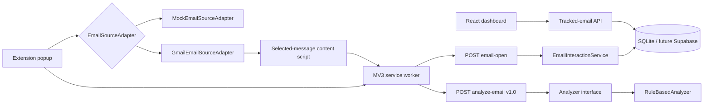

# Architecture

Gmail DOM assumptions are confined to `gmailSelectors.ts` and `GmailEmailSourceAdapter`. The popup, service worker, API client, and backend receive typed metadata and do not know Gmail selectors. Mock mode follows the same contracts and remains the automated-test default.

## Duplicate prevention

The content script debounces mutations by 600 ms and tracks each visible message ID once until another message is selected. FastAPI separately ignores the same user/message `email_open` within five seconds. Reopening later remains countable.

## Analysis pipeline

`Analyzer` currently resolves to `RuleBasedAnalyzer`. `/api/v1/analyze-email` accepts schema version `1.0` and returns behaviors, recommendation, risk, classification, and `modelVersion: null`. Future BRL, text/URL feature extractors, ML classifier, and explanation generator should be introduced behind this boundary. Rule-based results must never be called ML predictions.

See [gmail-integration.md](gmail-integration.md) for operational limitations.

## SE-BRL API contract boundary

The backend includes a strict, frozen Pydantic representation of the existing
SE-BRL structural result envelope and a domain-to-Pydantic adapter. The adapter
accepts only an immutable `ml.se_brl.ResultEnvelope`, uses the domain serializer,
and revalidates versions, canonical ordering, statuses, and cross-field
compatibility at the backend boundary.

This boundary is not connected to a live endpoint. Existing email analysis
remains rule-based, and the safe current SE-BRL analytical status is
`not_evaluated`. FastAPI routing, shared TypeScript contracts, extension and UI
integration, and ML models remain deferred.

## Internal SE-BRL orchestration

An internal backend service sits between future FastAPI routing and the existing
domain-to-Pydantic adapter. It constructs only `not_evaluated`,
`review_required`, and `failed` responses with canonical identifiers and fixed,
non-sensitive limitations. No completed analytical path exists.

The service is not connected to a FastAPI route, and existing email analysis
remains rule-based. Models, calibration, frozen risk rules, shared TypeScript
contracts, extension integration, and dashboard integration remain deferred.
